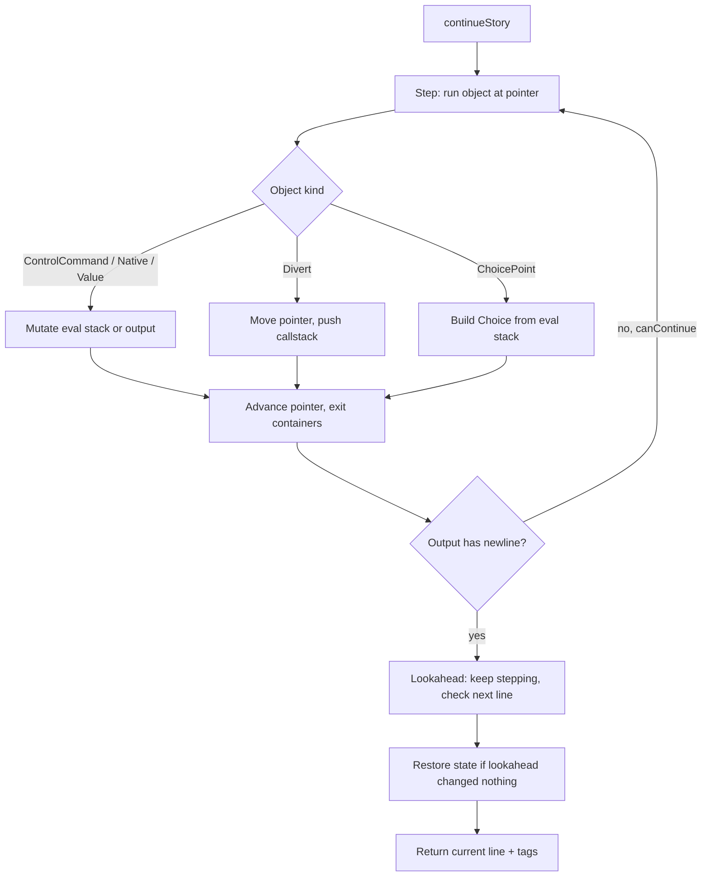

# ink_dart — package spec

Status: draft, 2026-09-22. Mirrors the Claude Doc "Ink runtime for Dart — package spec"; the doc is the editable original, this file is the repo copy.

## Purpose and scope

A pure Dart package that runs stories compiled to ink's JSON runtime format, with behaviour identical to the reference C# runtime and its ports (inkjs, blade-ink). Pure Dart, not Flutter: no Flutter dependency, so it tests on the Dart VM, runs on the server, and a thin `flutter_ink` widget package can sit on top later.

**Fork or port: decided 2026-09-22, port from inkjs; `ink_runtime` stays a second reference only.** [ink_runtime 2.0.0](https://pub.dev/packages/ink_runtime) is on pub.dev: a Dart implementation, Apache-2.0, uploaded about two years ago, minimum Dart 3.0, targeting ink 1.1.1, with changelog entries for lists, threads and multi-flow ([versions](https://pub.dev/packages/ink_runtime/versions), [changelog](https://pub.dev/packages/ink_runtime/changelog)). Its homepage `github.com/dietfriends/ink.dart` is unreachable. pub.dev never deletes published archives, so the full source is still downloadable with `dart pub cache` or from the versions page. Against it: 90 of 160 pub points, no dartdoc, a placeholder README, and dependencies on `darq`, `equatable`, `freezed_annotation`, `quiver` and `stack` ([score](https://pub.dev/packages/ink_runtime/score)). Use it only to cross-check behaviour when inkjs and C# disagree.

**In scope:** everything the ink 1.2 runtime does: flow, choices, diverts, tunnels, functions, threads, variables, lists, tags, external functions, visit and turn counts, save and load of state, error reporting, `EvaluateFunction`, `ChoosePathString`, variable observers.

**Out of scope:** the compiler (author in Inky, compile with inklecate or inkjs's compiler to JSON), the ink parser, Inky integration, any UI, and any story-specific logic. Multi-flow (`SwitchFlow`) is deferred to a later phase.

## Public API

Mirror the reference `Story` API name for name, in Dart casing. Anyone who has used ink in Unity or inkjs should need no docs, and the official ink documentation becomes this package's documentation.

```dart
import 'package:ink_dart/ink_dart.dart';

final story = Story.fromJson(jsonString);

// Game-side values and functions before the first Continue
story.variablesState['str_mod'] = 1;
story.bindExternalFunction('roll', (int sides) => rng.nextInt(sides) + 1);
story.observeVariable('gold', (name, value) => hud.gold = value as int);

while (story.canContinue) {
  final text = story.continueStory();   // one line, with trailing newline
  final tags = story.currentTags;        // tags attached to that line
  render(text, tags);
}
for (final c in story.currentChoices) show(c.index, c.text, c.tags);
story.chooseChoiceIndex(0);

final saved = story.state.toJson();      // persist between sessions
story.state.loadJson(saved);
```

| Member | Purpose |
| --- | --- |
| `Story.fromJson(String)` / `Story(Map)` | Parse compiled JSON; throw on unsupported `inkVersion` |
| `canContinue`, `continueStory()`, `continueMaximally()` | Advance flow one line, or until a choice or the end |
| `currentText`, `currentTags`, `currentChoices` | Output of the last continue |
| `chooseChoiceIndex(int)`, `choosePathString(String, {resetCallstack})` | Player input; authored jumps |
| `variablesState` | Map-like read/write of globals; typed getters |
| `observeVariable(name, fn)`, `removeVariableObserver` | Change callbacks for the game side |
| `bindExternalFunction(name, fn, {lookaheadSafe})`, `unbindExternalFunction` | Game functions callable from ink; fallback to ink definition when unbound |
| `evaluateFunction(name, args)` | Call an ink function from the game and get its return and text |
| `state.toJson()`, `state.loadJson()`, `resetState()`, `resetCallstack()` | Save and load; must interoperate with inkjs/C# save JSON |
| `globalTags`, `tagsForContentAtPath(path)` | Metadata for menus and encounter setup |
| `hasError`, `hasWarning`, `currentErrors`, `onError` | Errors as data, never silent |
| `allowExternalFunctionFallbacks` | Author-side fallbacks during development |

`continueStory` rather than `Continue`: Dart reserves `continue`. Everything else keeps its reference name so the ink docs apply unchanged.

## The ink JSON runtime format

The official [format document](https://github.com/inkle/ink/blob/master/Documentation/ink_JSON_runtime_format.md) is the right starting point and is out of date: its example says `inkVersion: 10`, and it omits lists, tags, glue and several control commands added since. The source of truth is the reference runtime's serialisation code (`JsonSerialisation.cs` in ink, `JsonSerialisation.ts` in inkjs). Parse from that, read the doc for intent.

Top level is `{"inkVersion": N, "root": [...]}` plus, when the story declares lists, a `listDefs` object of list name → item name → value. The runtime should accept a range of versions (the reference accepts a minimum compatible version, not one exact number) and refuse others with a clear error.

**Documented in the format doc**

| JSON | Runtime object | Notes |
| --- | --- | --- |
| `[..., null \| {named, "#f", "#n"}]` | Container | Last element is the named-content dictionary; `#f` bit flags: 1 visits, 2 turns, 4 count-start-only |
| `"^text"`, `"\n"`, `5`, `5.6` | StringValue, IntValue, FloatValue | `^` escapes strings; newline needs no prefix |
| `{"^->": "path"}` | DivertTargetValue | A divert target as a value |
| `{"^var": "x", "ci": n}` | VariablePointerValue | `ci` −1 unresolved, 0 global, ≥1 callstack index |
| `"void"` | Void | Function returned nothing |
| `"ev" "/ev" "out" "pop" "du" "str" "/str" "nop"` | ControlCommand | Evaluation mode, output, string mode |
| `"->->" "~ret"` | ControlCommand | Pop tunnel / pop function; kept distinct for error checking |
| `"choiceCnt" "turn" "turns" "visit" "seq" "thread" "done" "end"` | ControlCommand | Counts, shuffles, threads, termination |
| `"+" "-" "*" "/" "%" "_" "==" "!=" "<" ">" "<=" ">=" "!" "&&" "\|\|" "MIN" "MAX"` | NativeFunctionCall | Booleans are ints, 1 is true |
| `{"->": path, "var"?, "c"?}` | Divert | `var` = target is a variable; `c` = conditional, pops a value |
| `{"f()": path}`, `{"->t->": path}` | Divert (function / tunnel) | Both push the callstack, typed |
| `{"x()": name, "exArgs": n}` | Divert (external) | Game-side function call |
| `{"VAR=": name, "re"?}`, `{"temp=": name}` | VariableAssignment | `re` = reassignment |
| `{"VAR?": name}`, `{"CNT?": path}` | VariableReference | The second is a read count |
| `{"*": path, "flg": bits}` | ChoicePoint | 1 condition, 2 start content, 4 choice-only content, 8 invisible default, 16 once-only |
| `a.b.3.0`, `.^.1` | Path | Names, indices, `^` parent; leading dot = relative |

**Not in the format doc; present in current runtimes.** Names below are taken from the blade-ink Rust port's [control command table](https://docs.rs/crate/bladeink/latest/source/src/control_command.rs) and the C# serialiser; verify against inkjs before relying on them.

| JSON | Runtime object | Notes |
| --- | --- | --- |
| `"<>"` | Glue | Joins lines across newlines |
| `"#"`, `"/#"` | ControlCommand BeginTag / EndTag | Dynamic tags (ink 1.1+); tags are content, not metadata |
| `"readc"`, `"rnd"`, `"srnd"` | ControlCommand | Read count, RANDOM, SEED_RANDOM |
| `"listInt"`, `"range"`, `"lrnd"` | ControlCommand | LIST_VALUE-from-int, LIST_RANGE, LIST_RANDOM |
| `{"list": {"L.item": v}, "origins"?: [names]}` | ListValue | An InkList; `origins` when empty |
| `"L^"` | NativeFunctionCall | List intersection; renamed from `^` to avoid the string prefix |
| `"?" "!?" "POW" "FLOOR" "CEILING" "INT" "FLOAT" "LIST_MIN" "LIST_MAX" "LIST_ALL" "LIST_COUNT" "LIST_VALUE" "LIST_INVERT"` | NativeFunctionCall | Contains, maths and list functions |
| `{"#": "text"}` | Tag (legacy static form) | Older compilers; keep parsing it |

The parser is a single recursive `jsonTokenToRuntimeObject` switch over token shape (string prefix, number, array, object key), exactly as the reference does it. Do not build a schema layer; the format is small and the reference's switch is the spec.

## Runtime architecture

Keep the reference architecture and its class names. Every ink port that has survived is a structural port, and every divergence is a place where conformance tests will fail for reasons that take days to find.

**Object model** (`lib/src/runtime/`): an abstract `RuntimeObject` with `parent` and `path`; `Container` (ordered content + named content + counting flags); `Value<T>` subclasses `IntValue`, `FloatValue`, `BoolValue`, `StringValue`, `DivertTargetValue`, `VariablePointerValue`, `ListValue`; `ControlCommand`, `NativeFunctionCall`, `Divert`, `ChoicePoint`, `VariableAssignment`, `VariableReference`, `Glue`, `Tag`, `Void`; `Path`, `Pointer` (container + index), `SearchResult`; `InkList`, `InkListItem`, `ListDefinition`, `ListDefinitionsOrigin`.

**State** (`StoryState`): the part that is saved. `CallStack` holding `Thread`s, each a list of `Element`s (pointer, push-pop type, temporaries, evaluation-stack height at push); the evaluation stack; the output stream (a list of runtime objects, not a string, so glue and tags can be resolved late); `currentChoices`; `VariablesState` (globals, default globals, observers, patch for lookahead); visit counts and turn indices keyed by container path; the current turn index; the story seed and previous random; `didSafeExit`; error and warning lists.

**Story** owns the root container, list definitions, external functions, the state, and the `Continue` machine.



One `continueStory` yields exactly one line. The reference does this by stepping until a newline appears in the output stream, then continuing speculatively to see whether the next content is glue (which would remove the newline) before restoring state and returning. Get this loop right first; everything else hangs off it.

**Serialisation** (`JsonSerialisation`): runtime object ↔ JSON token both ways, plus `StoryState` ↔ JSON with the reference's `inkSaveVersion` and its minimum compatible version. Save JSON must round-trip with inkjs so a story saved in one runtime loads in another.

**Errors** are collected into `state.currentErrors` and surfaced through `onError`; a `StoryException` is thrown only when the caller has set no handler. The reference distinguishes errors from warnings; keep both.

**Random**: a small, seedable PRNG that yields the same sequence as the reference for a given seed. The C# runtime uses `new System.Random(seed)` (checked in `Story.cs` at v1.2.1), so the port reproduces .NET's seeded generator (Knuth subtractive); inkjs's own park-miller `PRNG` gives different sequences and is not the target. Shuffles and `RANDOM()` depend on it, so a conformance transcript with randomness is only reproducible with the same generator.

## Semantics that are easy to get wrong

Each of these has cost a port days. Write a conformance test for each before implementing it.

| Area | The rule | Typical bug |
| --- | --- | --- |
| Whitespace and newlines | Output stream trims leading whitespace on a line, collapses consecutive newlines, and a newline followed by glue is removed | Double blank lines; missing space after glue |
| Glue `<>` | Removes the newline before it *and* suppresses the next one; this is why `continueStory` looks ahead before returning a line | Line splits where the author glued |
| String evaluation mode | `str` pushes a marker onto the output stream; `/str` pops everything back to the marker into one string value | Choice text with a stray newline; `{}` inline logic leaking into output |
| Choice generation | ChoicePoint pops in flag order: condition, then start text, then choice-only text; `*` choices hide when the target's read count > 0; invisible defaults fire only when no visible choice exists | Choices in wrong order; defaults never taken |
| Visit and turn counts | Recorded on container *entry*, with `#f` deciding whether entry mid-container counts; `TURNS_SINCE` returns −1 for never | Off-by-one on `visits`; sequences advancing twice |
| Sequences and shuffles | `seq` uses the story seed plus the sequence's visit count; a stopping sequence clamps, a cycle wraps, a shuffle permutes per cycle | Shuffles not reproducible across save/load |
| Tunnels vs functions | `->->` and `~ret` are checked against the push type on the callstack; a function call evaluates in its own eval-stack frame and must leave exactly one value or `void` | "Found tunnel onwards but expected function return" errors |
| Threads | `thread` clones the callstack; choices remember the thread they came from and restore it when chosen; `done` pops a thread if there is more than one | Choices from `<-` disappearing; wrong temporaries after choosing |
| Temporaries and `ref` params | Temps live on the callstack element; `VariablePointerValue` with `ci` resolved at call time | Pointer to a temp that no longer exists |
| Lists | An `InkList` is a set of items with origins; empty lists keep `origins` so `LIST_ALL` and `+`/`-` still work; comparison and `?` are set semantics | `LIST_ALL(empty)` returns nothing; `+ 1` on a list fails |
| External functions | Calls during lookahead are suppressed unless marked `lookaheadSafe`; unbound externals fall back to the ink function of the same name, else error | Game function fires twice per line |
| Tags | Dynamic tags are content between `#` and `/#`; tags before the first line are `globalTags`; tags belong to the line they follow | Tags attached to the wrong line |
| Variable observers | Fire only on real assignment, not during lookahead; batched until the end of `continueStory` | HUD flickers from speculative values |
| `choosePathString` | Resets the callstack by default (`resetCallstack: true`); with `false` it pushes a tunnel | Story stuck after an authored jump |
| Save and load | State JSON stores callstack by paths and indices, visit counts by path string, choices by target path; the story must be identical to load | Load succeeds silently and then diverges |

The reference implementations are the specification for each row; where this table and the reference disagree, the reference wins and this table gets corrected.

## Porting strategy

Port [inkjs](https://github.com/y-lohse/inkjs) (TypeScript, MIT, the port inkle recommends and keeps in step with C#) file by file, keeping class and method names. Use the C# runtime as the tie-breaker when inkjs is unclear, and blade-ink (Java) when you want to see the same thing in a language with Dart's shape. Do not design your own runtime and then check it against tests; structural ports pass conformance, redesigns do not.

TypeScript to Dart is a mechanical translation for this codebase: classes, enums, nullable types, generics, `Map`/`List`. Watch four things:

- Integer vs float: JS has one number type; Dart has `int` and `double`. ink distinguishes them, so `IntValue` and `FloatValue` must stay distinct and arithmetic must follow ink's promotion rules, not Dart's.
- Equality: plain data types (`Path`, `Pointer`, list items, `InkList`) need `==` and `hashCode`, or maps keyed by them break silently. Runtime objects keep the reference's identity equality, except `Divert`, which compares by target as in C#; variable observers and path lookup depend on this.
- Nulls: turn inkjs's defensive null checks into Dart's sound null safety; do not sprinkle `!`.
- No reflection: the reference uses none; keep it that way for AOT.

**Phases, each ending green on its slice of the conformance corpus**

1. **Core flow.** Done: the whole runtime, including lists, threads and multi-flow, is ported, and all 168 goldens pass.
2. **Persistence and game interface.** Verify `StoryState.toJson`/`loadJson` (a round trip over every golden), variable observers, external functions with lookahead safety and fallbacks, `evaluateFunction`, `choosePathString`, tags and `globalTags` with scripted cases.
3. **Lists and threads.** Verify with scripted cases, starting with thread choices across save/load, and vendor ink's own C# test stories.
4. **Later.** Verify multi-flow with scripts that call `SwitchFlow`/`RemoveFlow`; profiler hooks; a `flutter_ink` package with a story widget and a debug view.

Adventuring Shape needs phases 1 and 2. Ship the package to pub.dev after phase 2 with lists and threads supported and multi-flow marked experimental until phase 4 verifies it.

## Conformance testing

The test oracle is the reference runtime, not your reading of it. Both ink and inkjs ship a corpus of small `.ink` files with expected output; inkjs's are organised by feature and are the easiest to reuse.

**Harness**

1. Vendor the `.ink` test files from inkjs (and ink's own `Tests`), grouped by the phase that should pass them.
2. Compile each with the C# ink compiler to JSON at a pinned ink version (decided 2026-09-23: ink 1.2.1; inkjs's compiler and runtime differ from C# on floats and randomness). Check the JSON into the repo so tests need no Mono or .NET at test time; keep the compile script for regeneration.
3. For each story, run the C# reference runtime (`tool/oracle`, .NET 10) with a fixed choice script and a fixed seed, and record the transcript: every line, its tags, every choice list, and the final state JSON. Check these in as goldens.
4. The Dart test runs the same JSON with the same choice script and seed and diffs line-for-line against the golden. Tests are data-driven: adding a case is adding three files.

**Beyond transcripts**

- **State round-trip**: at every choice point, `toJson` → fresh `Story` → `loadJson` → continue; the transcript must be identical to the uninterrupted run.
- **Cross-runtime load**: load an inkjs-produced save into Dart and a Dart-produced save into inkjs; both must continue identically.
- **Error corpus**: stories that must produce a specific error or warning (tunnel/function mismatch, unbound external, divert to missing path) produce it as data, at the same line.
- **Determinism**: same seed, same transcript, across three runs and across VM and AOT.
- **Fuzz** (later): random choice scripts over the corpus; the only acceptable outcomes are a clean end or a reported error, never an exception or a hang.

**Acceptance per phase**: 100% of that phase's goldens. A skipped test needs a comment naming the reference behaviour it is waiting on. Coverage is not a target; conformance is.

## Package structure and tooling

One pure Dart package, one optional Flutter package on top, in a small monorepo.

```
ink_dart/
  packages/
    ink_dart/               # pure Dart, zero Flutter
      lib/ink_dart.dart     # public exports only
      lib/src/runtime/      # object model, one file per class, reference names
      lib/src/state/        # StoryState, CallStack, VariablesState
      lib/src/json/         # JsonSerialisation, PRNG
      lib/src/story.dart
      test/conformance/     # <case>.ink, <case>.json, <case>.golden.json
      test/unit/
      tool/regen_goldens.sh # node inkjs compiler + runner
    flutter_ink/            # later: StoryController, StoryView, debug panel
  melos.yaml or a plain workspace
```

| Concern | Choice |
| --- | --- |
| Dependencies | `collection`, `meta` at most. No `freezed`, no code generation, no reflection |
| Dart SDK | Current stable, sound null safety, `dart analyze` clean with `package:lints/recommended` |
| Name | `ink_dart`, mirroring inkjs. `ink_runtime` and `ink` are taken; `ink_dart` looked free on 2026-09-22, confirm before the first publish |
| Version | Package semver; `README` and a constant state the supported `inkVersion` range and `inkSaveVersion`. Bump minor when adding an ink version |
| Licence | MIT, matching ink and inkjs, with their notices reproduced |
| CI | GitHub Actions: analyze, format check, VM tests, one AOT-compiled conformance run, pana score gate |
| Publishing | pub.dev with a verified publisher; example folder with a console runner that plays any compiled JSON |
| Docs | Dartdoc on every public member; README points to the official ink documentation for the language itself |

The console runner (`example/play.dart`) doubles as the manual test tool: it loads a JSON, prints lines and choices, takes choice indices from stdin, and dumps state on request. Build it in phase 1; it makes every later bug reproducible in one command.

## Integration with Adventuring Shape

The app talks to the runtime only through the public API above; nothing in the story engine knows about health data, and nothing in the runtime knows about the app.

**Variables in.** Before each session's beat, the app writes `str`, `dex`, `con`, their modifiers, the moon count, `wounded`, and the tag tallies (`brawn`, `finesse`, `endurance`, `cunning`) into `variablesState`. The ink declares them with `VAR` so authors can reference them in prose and conditions.

**Dice.** The roll is an external function, `EXTERNAL roll(sides)`, bound by the app so the app's seeded RNG and the UI's dice animation stay in sync. Ink writes the check: `{roll(20) + str_mod >= 11: success text | failure text}`. Mark it `lookaheadSafe: false` so the runtime never rolls speculatively. Provide an ink fallback `=== function roll(sides) === ~ return RANDOM(1, sides)` so stories play in Inky without the app.

**Tags out.** Encounter metadata travels as tags on the line that opens an encounter: `# encounter: stat=str dc=11 tag=brawn`, `# gear: reroll`. The app parses `currentTags` after each `continueStory`. Choice tags carry the class tag for the tally.

**One beat per session.** The story is authored so each beat ends at a choice or a `# beat_end` tag; the app calls `continueMaximally` to the end of the beat, then persists `state.toJson()` in SQLite alongside the session that unlocked it.

**Content packs.** A pack is a compiled JSON plus a manifest (title, `inkVersion`, required externals, required variables, assets). The app validates the manifest against the runtime's supported range before loading, so a pack compiled with a newer ink fails at install, not mid-story.

**Delve loop.** Recombinant rooms do not fit ink well, as noted in the app spec. Two ways to keep one engine: author rooms as ink stitches and let the app pick the next room with `choosePathString`; or run delves from the app's own node format and use ink only for the hub. Decide when arc two is designed; the runtime API supports both.

## Effort, risks and open questions

A fresh port through phase 2 is roughly 4–6 weekends for someone who reads TypeScript fluently and has not written an interpreter before: the reference runtime is on the order of ten thousand lines, most of it mechanical, and the harness is a weekend on its own. This is larger than the story engine the app spec called "a weekend", which is why the app can start on a custom node format and switch to ink when the runtime passes phase 2.

| Risk | Mitigation |
| --- | --- |
| Subtle divergence from the reference that only shows in long stories | Structural port, golden transcripts, state round-trips at every choice |
| Save-file incompatibility across runtime versions | Follow `inkSaveVersion`; test cross-runtime load both ways |
| Randomness not reproducible | Port the reference PRNG exactly; seed in every conformance case |
| Integer/float confusion from the JS source | Distinct value classes; arithmetic tests for every operator and type pair |
| Time sink displaces the app and the training | Phase gates; the app does not wait on the runtime |

Open questions:

- [x] Pin the ink and inkjs versions to conform to: the C# runtime and compiler of ink 1.2.1 (tag `v1.2.1`, `35c63e5`) as the oracle, the story corpus from inkjs commit `6b11534`; `inkVersion` 21, `inkSaveVersion` 10. Stories with `inkVersion` 18–21 load, as in C#. Numbers follow C# (32-bit floats, no demotion of whole floats to ints), decided 2026-09-23.
- [ ] Confirm `ink_dart` is free on pub.dev before first publish
- [ ] Whether the app's arc one waits for phase 2 or ships on the custom node format first
- [ ] Whether multi-flow is ever needed (parallel hub and delve stories would use it)
